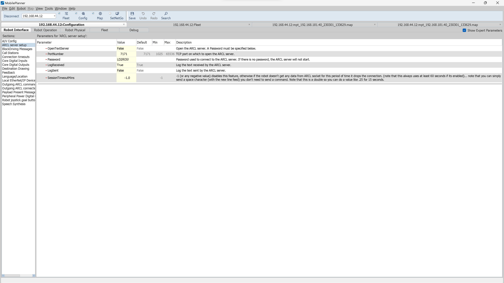

# Omron LD-90
De LD-90 heeft een ingescande kaart van de elektrotechniek gang (van G2 tot en met H2). Hier kan de LD-90 autonoom in rondreiden als deze een punt door krijgt waar deze heen moet. De aansturing waar en wanneer de LD-90 ergens heen moet gaat via ROS2. De communicatie hiertussen gaat bedraad via de router met he ARCL protocol.

## 1. Handleiding
Het setup LD-90.docx is een handleiding voor het gebruiken van de Omron LD-90. Dit is een verkorte samenvatting van de grote handleiding en met de inloggegevens en instellingen hoe de LD-90 nu is ingesteld.

## 2. Zei lidar's instellen
Omdat er een frame en robot arm bovenop de LD-90 komt is deze te hoog om onder een tafel door te gaan. En omdat de standaard lidar die er op zit alleen horizontaal kijkt op een laag niveau kan deze tafelbladen niet zien en er dus tegenaan rijden. Daarom zijn er 2 zei lidars toegevoegd. Deze kijken links en rechts van de robot verticaal. Let er wel op dat bij het inscannen van een map hij deze lidars niet meeneemt met het genereren van de map. Hierdoor denkt de LD-90 soms dat hij onder een tafel door kan gaan maar als hij er is zien de zei lidars de tafel. Om dit te voorkomen is het wel van belang om de kaart aan te passen met verboden gebieden waar de tafels en ander positiefe en negatieve objecten zijn.

De instellingen van de zei lidar's kunnen worden aangepast via de MobilePlanner via een laptop of PC. De instellingen zijn als volgt.

Lidar 1(rechts): 

Lidar 2(links):

## 3. ARCL instellingen
Als eerst moet de ARCL server op de LD-90 aan worden gezet. Dit gaat net als met de zei lidar's via de MobilePlanner op een laptop of PC. Deze instelling gaat via het kopje "ARCL server setup".

Het gaat hier vooral om de OpenTextServer en Password. De OpenTextServer moet op true staan zodat de ARCL server automatisch opstart. Het Password kan zelf worden ingesteld, deze wordt weer gebruikt aan de ros2 kant om een connectie met de LD-90 te maken. Hier is een voorbeeld van hoe het ingesteld kan zijn:

Voorbeeld van een ingestelde ARCL server setup.

Verder moet de Outgoing ARCL connection setup worden ingesteld. Hierin wordt ingesteld naar welk ip adress de ARCL commando's worden gestuurd vanuit de LD-90.

1. OutgoingHostname: 192.168.44.13

Dit is het ip adress van de computer/laptop welke de commando's ontvangt en verwerkt met ros2. In dit geval is dit de Jetson AGX orin. Deze heeft via de MikroTik router een statisch ip adress gekregen. Het is ook sterk aangeraden om dit ip adress op de router statisch in te stellen omdat anders dit iedere keer veranderd moet worden als de router een nieuw ip adress geeft.

2. OutgoingPort: 7179

Dit is het port nummer dat wordt gebruikt voor de uitgaande ARCL commando's. Dit is het standaard port nummer en wordt ook aangeraden om dit ook zo te laten. Mocht dit toch worden aangepast moet dit ook bij de ros2 instellingen worden aangepast.

3. SendStatusInterval: 0

Dit is hoe vaak het ARCL command word verstuurt maar omdat er gebruik wordt gemaakt van meerdere commando's met verschilende intervals zetten we deze uit door hem op 0 te zetten.

4. OutgoingSocketTimeoutInMins: -1.0

Dit geeft aan na hoeveel minuten de ARCL connectie moet sluiten omdat hij niks ontvangt. Gezien in dit project er niet constant een commando wordt verzonden zetten we deze op -1.0 zodat de connectie niet automatisch wordt verbroken.

5. RequireConnectionToPathPlan: True

Dit is een veiligheids instelling wat er voor zorgt dat als er tijdens het rijden geen connectie meer is met de ARCL client (ros2) de robot stopt met rijden. Hiervoor zetten we deze instelling op True.

Hieronder een voorbeeld van hoe dit is ingesteld:

Voorbeeld ingesteld outgoing ARCL connection setup.

Als laatste moet er nog worden ingesteld wat er wordt verzonden naar de ARCL client (ros2). Dit wordt gedaan in de outgoing ARCL command setup. Hierin hebben we de volgende instellingen:

1. OutgoingCommands1: Status

Dit verzend de status van de LD-90 naar de ARCL client. Dit zegt op de LD-90 klaar is voor een commando, dat hij aan het opladen is of dat de noodstop is ingedrukt.

2. OutgoingCommands1Seconds: 0.1

De status wordt elke 0.1 seconde verstuurd

3. OutgoingCommands2: RangeDeviceGetCurrent Laser_1

Dit verzend de data van de hoofd lidar op de LD-90 naar de ARCL client. Hierdoor kan in ros2 de XY punten van de lidar worden gevisualiseerd.

4. OutgoingCommands2Seconds: 0.5

De lidar wordt met een frequentie van 2 HZ geupdate. Dit zou ook sneller kunnen maar omdat het puur voor het visualiseren is is dit niet zo nodig. Het kost meer reken kracht als deze sneller wordt gezet.

5. OutgoingCommands3: GetGoals | Odometer | ApplicationFaultQuery

Dit verzend de goals, odometer en ApplicationFaultQuery naar de ARCL client. 

6. OutgoingCommands3Seconds: 0.6

De interval van dit is ingesteld op elke 0.6 seconde.

Een voorbeeld van deze instellingen is hieronder te zien:

Voorbeeld instellingen van de outgoing ARCL command setup

## 4. Voeding andere onderdelen
Op de LD-90 zitten meerdere voedings connectoren voor het voeden van apparaten die op de LD-90 worden geplaatst. Denk hierbij aan de safety PLC, router en embedded AI computer. De LD-90 heeft vaste voedings outputs van 5V en 12V maar deze zijn maximaal 1A, daarom is er gebruik gemaakt van DC-DC converters. Deze zijn aangesloten op de Battrry output connector, deze is doorverbonden met de accu met een zekering van 2X 5A voor een totaal van 10A. Er zijn een totaal van 2 DC-DC converters, een naar 12V en een naar 24V. De 12V DC-DC converter zit op BatteryOut_1 en de 24V DC-DC converter zit op BatteryOut_2. Voor meer informatie over de vodingen en componenten bekijk de [readme](https://github.com/stebenpe/MobileManipulator/tree/main/besturingskast) van de besturingskast.