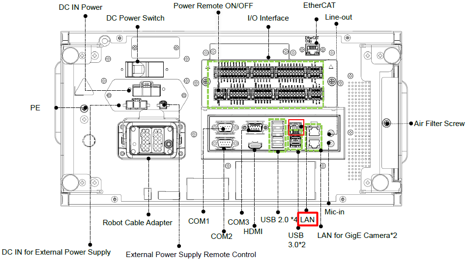
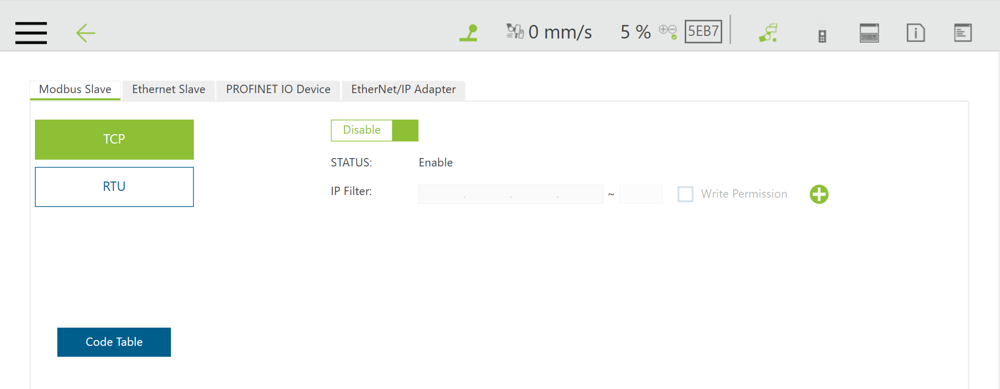
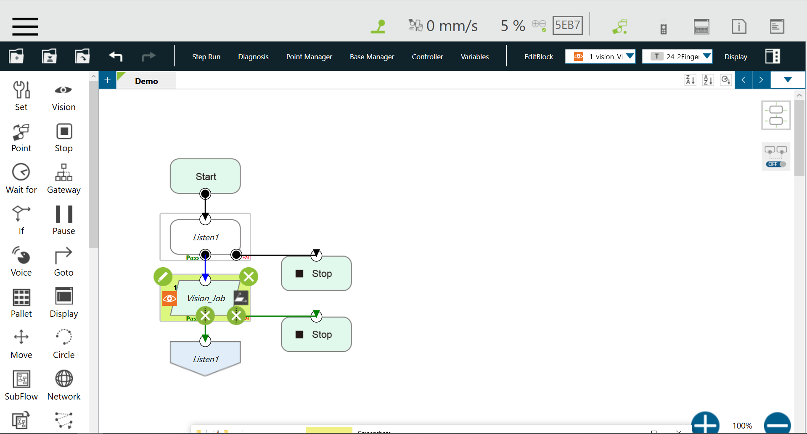
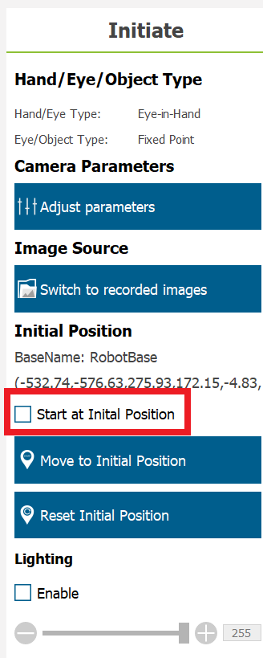

# Omron TM5M-900
De gekozen robotarm voor de MoMa is de TM5M-900 cobot van Omron. De reden hiervoor is omdat dit een mobiele robot arm is, vandaar ook de "M" in de naam. Het verschil tussen deze en de niet mobiele versie (de TM5-900) is dat de mobiele versie de mogelijkheid heeft om op een accu aangesloten te worden. Deze accu kan een voltage hebben van tussen de 22 en 60 volt DC. Verder is dit een cobot dit betekent dat er geen veiligheidsscherm omheen nodig is omdat deze bij te veel weerstand de robot arm stopt. Dit kan bijvoorbeeld gebeuren als iemand zijn hand tussen de robotarm doet. Nog een voordeel van deze robotarm is zijn bereik. De robotarm kan namelijk tot 900 mm iets oppakken, vandaar ook de "900" in de naam. 

# Safety PLC connectie
De robotarm is aangesloten op de safety PLC via de safety IO van de control box. De aangesloten safety IO zijn de safety output 0 deze geeft aan of de robotarm in noodstop staat of niet (als deze hoog is staat hij niet in noodstop), safety input 1 dit is de pauze input voor de robotarm, safety input 2 dit is de collaborative input van de robot arm (als deze is ingeschakeld dus laag is zal de robotarm minder snel bewegen) en safety input 4 dit is om de robot arm in noodstop te zetten (als deze hoog is staat de robotarm niet in noodstop). Voor het aansluitschema hiervan kan je naar [deze](https://github.com/stebenpe/MobileManipulator/blob/main/besturingskast/e-plan/EPLAN%20Mobile%20Manipulator%2030-01-2024.pdf) EPLAN tekening kijken.

# Modbus instellingen
Om Modbus te gebruiken is het belangrijk om te controleren of de internetkabel in de juiste internetpoort zit. Van de 4 internet poorten is er namelijk maar 1 die Modbus ondersteund. Zie de foto hieronder met in het rood aanduid welke poort gebruikt moet worden.

Verder moet in de instellingen van de robot de Modbus TCP aanstaan. Dit kan je vinden onder Setting → Connection → Modbus. Zie de foto hieronder voor verdere aanduiding:

# Ethernet slave instellingen
Om de TM ros2 driver te kunnen laten communiceren met de listen node van de robotarm moeten de instellingen van de ethernet slave geconfigureerd worden. Dit kan je vinden onder Setting → Connection → Ethernet slave. Zorg er eerst voor dat deze uit staat zodat de instellingen hiervan kunnen worden aangepast. Dit kan worden gedaan door op de "Data Table Setting" knop te drukken. Hierin moeten de volgende waarden worden opengezet om uit te kunnen worden gelezen door de ros2 driver:
✓ Robot_Error

✓ Project_Run

✓ Project_Pause

✓ Safeguard_A

✓ ESTOP

✓ Camera_Light

✓ Error_Code

✓ Joint_Angle

✓ Coord_Robot_Flange

✓ Coord_Robot_Tool

✓ TCP_Force

✓ TCP_Force3D

✓ TCP_Speed

✓ TCP_Speed3D

✓ Joint_Speed

✓ Joint_Torque

✓ Project_Speed

✓ MA_Mode

✓ Robot Light

✓ Ctrl_DO0~DO7

✓ Ctrl_DI0~DI7

✓ Ctrl_AO0

✓ Ctrl_AI0~AI1

✓ END_DO0~DO3

✓ END_DI0~DI2

✓ END_AI0

Let op dat de instellingen op binary moeten staan en klik vervolgens op "save". Nu kan de ethernet slave optie weer worden aangezet.

# Listen node instellen
Op de robotarm kan vervolgens een heel simpel programma worden gemaakt die er als volgt uitziet:

Hier wordt gebruikt gemaakt van de listen node, vision node, goto node en stop node. Het is niet aangeraden om nog meer nodes toe te voegen. Hoewel dit wel mogelijk is is het beter om alles verder aan de ros2 kant te doen. Als je op het potlootje klikt van de listen node kan je een vision job toevoegen. Deze geef je een naam en de manier van herkennen. Dit herkennen kan met een TM marker maar kan ook met een eigen marker of een vorm van een object. Het meest accuraat is de TM marker dus dit is ook aangeraden om te gebruiken. Let er wel op dat je bij de initial instellingen van de vision job de "Start at initial position" moet uitzetten. Anders gaat de robotarm iedere keer naar de initial position die gedefinieerd is en dan naar die in ros2 is gedefinieerd. Zie onderstaande foto voor verduidelijking.

