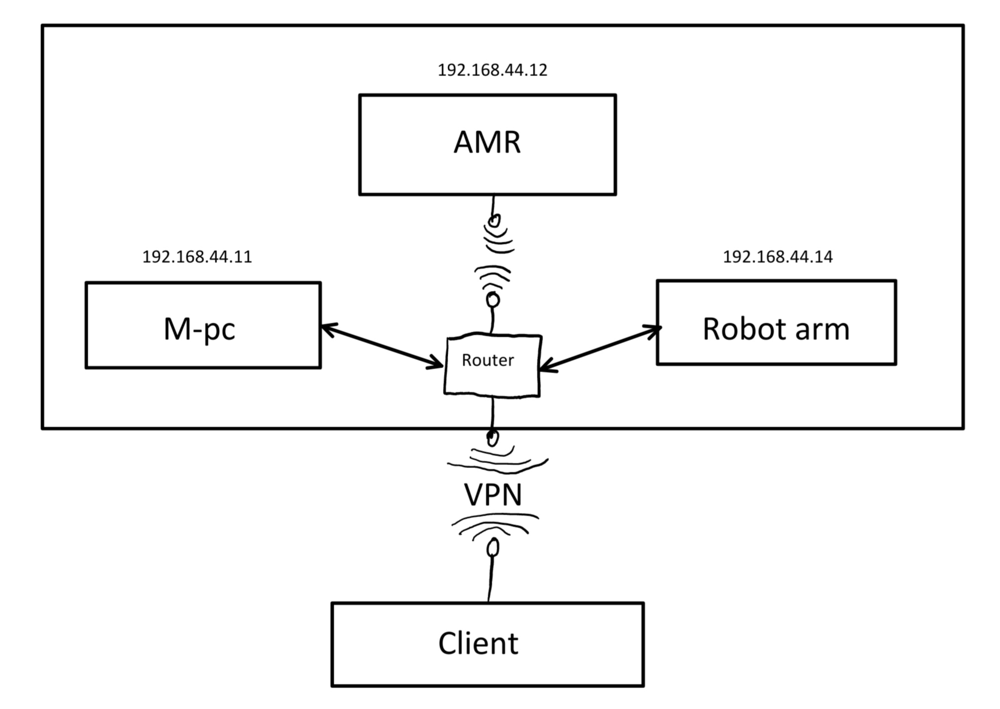
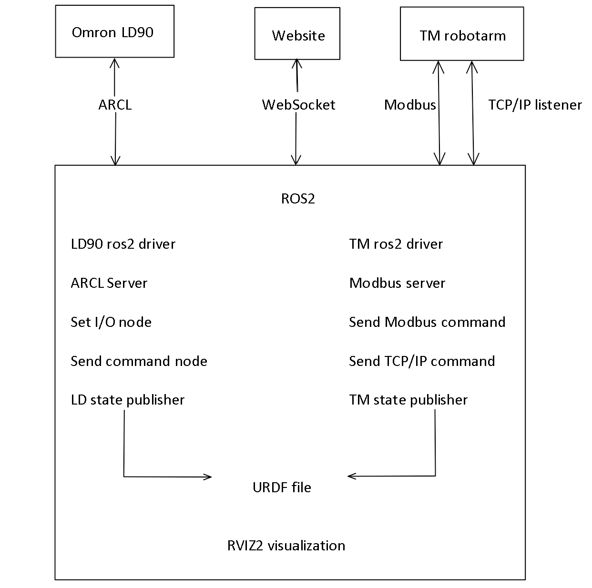

# Mobile Manipulator

Bedrijfs begeleider: Johannes Bruinsma

School begeleider: Rieno Moedt

Gemaakt door: Steven Pennock

Datum: 28 januari 2024

# Mobile Manipulator stage NHL-Stenden

Op een luie manier koffie halen

# Begrippen lijst

1. ROS2: Robot Operating System 2, een veel gebruikt systeem om allerlei soorten robots aan te sturen. Er wordt geprogrammeerd met nodes, topics en services in C++ en of Python, hierin kunnen python nodes met C++ nodes samenwerken zonder problemen of instellingen via topics en services wat het erg vrij maakt. Topics zijn bruggen tussen nodes en kunnen dus data van een node doorsturen naar een andere node. Services zijn ook bruggen tussen nodes en kunnen dus data van een node doorsturen naar een andere node en ook data terug teruggeven.
2. VUE.js: Een hulpmiddel voor het maken van een website. Dit wordt gedaan met HTML, Java Script en CSS.
3. AMR: Autonomous Mobile Robot, oftewel een autonoom rijdende robot.

# Voorwoord

Voor mijn opleiding elektrotechniek zat ik een lange tijd te zoeken naar een goeie minor die mij echt aansprak en uitdaagde. Omdat ik hier maar niet uit kon komen heb ik bij de docenten van elektrotechniek rondgevraagd en ben ik uiteindelijk via Johannes Bruinsma op de mogelijkheid gekomen om de nieuwe minor "Smart Industry" op te zetten. Dit leek mij een hele mooie uitdagende mogelijkheid. Helaas was dit uiteindelijk niet mogelijk maar kon ik wel in plaats van een minor een verdiepende tweede stage (VTS) op school doen. Hier heb ik toen ook voor gekozen en Johannes Bruinsma werd daarbij ook mijn bedrijfs begeleider.

Ik wil hierbij Johannes Bruinsma bedanken voor de mogelijkheden die hij voor me heeft opengesteld en de vrijheid die ik hierin kreeg. Zonder jou had ik dit nooit kunnen doen en mezelf zo kunnen ontwikkelen.

Ook wil ik Rieno Moedt bedanken voor meedenken met stukken van de opdracht en mijn verslaglegging die ik nu via github heb mogen doen. De deur stond altijd bij je open en je was oprecht geintreseerd en nieuwsgierig naar het project.

Verder wil ik Hendrik Bijlsma bedanken voor het helpen met de programeer en linux problemen. Zonder jou was het mij niet gelukt om zo ver te komen met het project, je stond altijd klaar voor me vragen en daar ben ik zeer dankbaar voor.

Als laatste wil ik Jan Landstra bedanken voor het openstellen van de werktuigbouwkunde werkplaats. Door jou heb ik het frame kunnen maken en wat kunnen proeven van wat werktuigbouwkunde doet.

# Samenvatting

NHL-Stenden heeft in 2022 een Omron LD90 aangeschaft voor het ontwikkelen van een MoMa (mobiele manipulator). Dit is een autonoom reidende robot (in dit geval een Omron LD90) met daarboven een manipulator (dit is een robotarm, in dit geval een Omron TM5M-900). Deze zou dan beschikbaar kunnen worden gesteld voor projecten en minoren van verschilende opleidingen. Dit is bijvoorbeeld het project industriele automatisering voor elektrotechniek en voor werktuigbouwkunde. Ook is het de bedoeling dat deze beschikbaar wordt gesteld voor de minor ASE (Advanced Software Engineering). Om dit te kunnen doen moet de MoMa wel instap klaar zijn. Hiervoor moest er een frame op de LD90 komen met daar de besturing in en een robotarm daarbovenop. Daarnaast moest er ook een voorbeeld project worden gemaakt om de mogelijkheden te laten zien en op die code te kunnen bouwen. In dit geval is het voorbeeld project koffie halen door middel van een website bedacht. Dit is een "redelijk simpele" opdracht voor wat de MoMa allemaal kan doen. Op deze github pagina (en een paar andere) is alles te vinden van het process dat hiervoor is ondergaan. Ook is alle code en 3D modellen te vinden op deze github pagina.

# Inhoudsopgave

1. [Inleiding](https://github.com/stebenpe/MobileManipulator?tab=readme-ov-file#1-inleiding)
2. [Probleemstelling](https://github.com/stebenpe/MobileManipulator?tab=readme-ov-file#2-probleemstelling)
3. [Progressie](https://github.com/stebenpe/MobileManipulator?tab=readme-ov-file#3-progressie)
4. [Onderdelen](https://github.com/stebenpe/MobileManipulator?tab=readme-ov-file#4-onderdelen)
5. [Netwerk](https://github.com/stebenpe/MobileManipulator?tab=readme-ov-file#5-netwerk)
6. [Website](https://github.com/stebenpe/MobileManipulator?tab=readme-ov-file#6-website)
7. [Omron LD-90](https://github.com/stebenpe/MobileManipulator?tab=readme-ov-file#7-omron-ld-90)
8. [Omron TM5M-900](https://github.com/stebenpe/MobileManipulator?tab=readme-ov-file#8-omron-tm5m-900)
9. [ZED 2i](https://github.com/stebenpe/MobileManipulator?tab=readme-ov-file#9-zed-2i)
10. [NVIDIA jetson AGX orin](https://github.com/stebenpe/MobileManipulator?tab=readme-ov-file#10-nvidia-jetson-agx-orin)
11. [Maak onderdelen](https://github.com/stebenpe/MobileManipulator?tab=readme-ov-file#11-maak-onderdelen)
12. [Besturingskast](https://github.com/stebenpe/MobileManipulator?tab=readme-ov-file#12-besturingskast)
13. [Ros2](https://github.com/stebenpe/MobileManipulator?tab=readme-ov-file#13-ros2)
14. [toekomst plannen](https://github.com/stebenpe/MobileManipulator?tab=readme-ov-file#14-toekomst-plannen)
15. [Conclusie](https://github.com/stebenpe/MobileManipulator?tab=readme-ov-file#15-conclusie)
16. [Bronnen lijst](https://github.com/stebenpe/MobileManipulator?tab=readme-ov-file#bronnen-lijst)

# 1. Inleiding

Ik ben Steven Pennock en ik heb als stage opdracht gekregen om koffie te halen.
Nou heb ik natuurlijk helemaal geen zin om zelf iedere keer koffie te halen dus daarom ga ik een MoMa (Mobile Manupulator) maken om dit voor mij te laten doen. Een MoMa is een rijdende robot met daarboven op een manipulator (robot arm) geplaatst. De bedoeling is dat als iemand koffie wil deze persoon via een website een order kan maken met een bezorgpunt en de MoMa zal dan autonoom de koffie zetten en brengen naar de aangegeven plek. Dit allemaal wordt aangestuurd door een NVIDIA jetson AGX orin die ros2 draait en een vue.js webserver. Verder heb ik het frame waar de besturing in zit en de robotarm bovenop gedesigned en gemaakt.
Op deze github pagina kan je hier alles van vinden.

# 2. Probleemstelling

Hoe kan de Omron LD90 mobiele robot en TM5M-900 robotarm geïntegreerd worden tot één werkend geheel, zodat deze als MoMa (Mobiele Manipulator) ingezet kan worden in projecten en minoren van NHL-Stenden?

# 3. Progressie
Componenten:
- [x] Uitzoeken 3D camera
- [x] Uitzoeken embedded AI computer
- [x] Uitzoeken robot arm

Netwerk:
- [x] Instellen mikrotik als bridge met school wifi en eigen subnet
- [x] Instellen mikrotik met vaste ip's
- [x] ROS2 netwerk instellingen toepassen
- [ ] VPN connectie naar router netwerk

ROS2:
- [x] ROS2 installeren op Jetson AGX orin en laptop
- [x] LD-90 aansturen met ROS2
- [X] 3D camera koppelen met ROS2
- [X] 3D map genereren met 3D camera
- [X] Ordering systeem koppelen met ROS2
- [X] MoveIt2 instellen robot arm
- [X] Maken state machine voor aansturen AMR en robot arm
- [X] ROS2 connectie maken met robot arm
- [X] URDF samenvoegen LD-90, frame, robot arm en gripper
- [X] Robot arm programma maken
- [X] Demo pick & place programma maken

Website:
- [x] Website maken
- [x] Data LD-90 visualiseren op website
- [X] Ordering systeem maken
- [ ] RVIZ2 visualiseren op website
- [ ] Camera beeld visualiseren op website

Besturingskast: 
- [X] Onderdelen uitzoeken en bestellen
- [x] 3D ontwerp besturingskast
- [x] EPLAN tekening besturingskast
- [X] Safety PLC programma maken
- [X] Besturingskast bedraden

Maak onderdelen:
- [X] SolidWorks designen trap sensor
- [x] SolidWorks designen alluminium behuizing
- [x] SolidWorks designen 3D prints
- [x] Totaal assembly SolidWorks maken
- [X] Onderdelen 3D printen
- [X] onderdelen watersnijden
- [X] onderdelen buigen, boren, tappen en verzinken
- [X] MoMa inelkaar zetten
- [X] Powder coaten onderdelen
- [X] Designen bekerhouder met magneten
- [X] Maken bekerhouder met magneten

Toekomst plannen:
- [ ] 3D camera programma maken met MoveIt2
- [ ] Pick & place demo programma met 3D camera
- [ ] Website uitbreiden met winkelmandje en que systeem toevoegen aan ros2
- [ ] Tool wissel station voor gripper maken en programmeren
- [ ] Flexibele gripper designen en maken

# 4. Onderdelen
- Omron LD-90 AMR (met zei lidar)
- Omron TM5M-900 robot arm
- Robotiq 2F-85 gripper
- ZED 2i 3D camera
- NVIDIA jetson AGX orin embedded AI computer
- MikroTik RB2011UiAS-2HnD router
- Omron NX-EIC202 tcp/ip controller
- Omron NX-SL3300 safety PLC
- Omron NX-SID800 safety input kaart 2X
- Omron NX-SOD400 safety output kaart 2X
- Omron G7SA-2A2B DC24 met din-rail houder 6X
- 12V 10A DC-DC converter
- 24V 5A DC-DC converter

# 5. Netwerk
Hieronder is een overzicht te zien van hou het huidige netwerk in elkaar zit:

Dit netwerk is gerealiseerd door middel van een MikriTik RB2011UiAS-2HnD.
Deze is op de MoMa bevestigd en word gevoed door de Omron LD-90 via de 12V AUX uitgang.
Er is gekozen voor deze MikroTik router door het brede voltage input van 10-28V, ervaring van school met deze speciefieke router en deze lag ongebruikt op school. 
De router krijgt zijn internet verbinding binnen op WLAN1 via het iotroam wifi netwerk. Deze netwerk verbinding wordt vervolgens met een bridge doorverbonden met het smartindustry netwerk welke als een AP bridge is ingesteld op WLAN2 en ETH 2-9. Deze bridge heeft een DHCP server ingesteld op het subnet subnet 192.168.44.0/24 en hier zijn alle onderdelen van de MoMa op aangesloten. ETH 1 staat open voor een WAN verbinding en ETH 10 is verbonden met het subnet 192.168.88.0/24. Dit subnet geeft de mogelijkheid om te de instelling van de router aan te passen welke op het ip adress 192.168.88.1 is ingesteld. Dit is gedaan zodat de instellingen hiervan niet zomaar veranderd kunnen worden, dit is namelijk nier zomaar de bedoeling en moet eerst in overleg worden gedaan.
Omdat de router is verbonden met iotroam kan je via het smartindustry netwerk ook verbinding maken met de UR robots en PLC's in het mechatronica lokaal. Dit geeft in de toekomst dus ook extra mogelijkheden voor projecten en uitbreidingen.

# 6. Website
De website is gemaakt door middel van VUE.js en werkt door middel van een websocket met ros2 samen. Via deze websocket kan deze puplishen en subscriben op topics en services van ros2. De webserver is ingesteld op de jetson AGX orin en kan via het ip adress daarvan mee worden bekeken op poort 80.
Voor meer uitleg over de website kan je kijken naar de [readme](https://github.com/stebenpe/MobileManipulator_website?tab=readme-ov-file#website) van de vue-webpanel.

# 7. Omron LD-90
De Omron LD-90 wordt gebruikt als het basisplatform van de MoMa. Hierop is vervolgens het frame en robotarm geplaatst.
Voor meer informatie over de Omron LD-90 en de instellingen hiervan kan je kijken naar de [readme](https://github.com/stebenpe/MobileManipulator/tree/main/Omron%20LD-90#omron-ld-90) van de Omron LD-90.

# 8. Omron TM5M-900
De Omron TM5M-900 is de gebruikte robotarm in dit project.
Dit omdat deze een groot bereik heeft van 900 mm en omdat dit een cobot is. Cobot betekent dat er geen veiligheids scherm omheen nodig is omdat deze bij te veel weerstand de robot arm stopt. Dit kan bijvoorbeeld gebeuren als iemand zijn hand tussen de robotarm doet. Ook is deze robotarm bedoeld voor mobiele applicaties waardoor deze op een accu kan werken van tussen de 22 en 60 volt. Dit zorgt ervoor dat deze op de accu van de LD90 kan worden aangesloten.

Voor meer informatie over de Omron TM5M-900 kan je kijken naar de [readme](https://github.com/stebenpe/MobileManipulator/tree/main/Omron%20TM5M-900) van de Omron TM5M-900.

# 9. ZED 2i
Om de mok en het koffie apparaat met AI te laten manipuleren met een robot arm wordt er gebruik gemaakt van een 3D camera. Er zijn verschilende soorten en merken 3D camera's. Er is voor de ZED 2i gekozen voor de resolutie, accuratie, afstandberijk en het voor gemaakte AI depth sensing algoritme. De ZED 2i heeft 2 2K camera's die op een afstand van 12 cm van elkaar zitten. Door het verschil tussen de 2 camera's te vergelijken kan het AI algoritme hier een dipte map uithalen. Dit kan tussen de 0.3 en 20 meter zijn en met een accuratie van <1% tot 3m en <5% tot 15m. Helaas is het niet gelukt om deze te intregeren in het programma van de robot wegens tijdgebrek. Het is wel de bedoeling om dit te doen in de minor ASE. Voor meer informatie over deze plannen zie het hoofdstuk toekomst plannen.

# 10. Nvidia jetson AGX orin
Voor dit project is gekozen voor een NVIDIA Jetson AGX orin 64GB developer kit. De keuze is hiervoor gemaakt omdat deze veel AI power heeft door de 2048 cuda cores en 64 tensor cores. Deze woren vooral gebruikt voor de 3D camera met het AI programma en de 3D visualisatie van de robot via RVIZ2. Ook is het modelijk om de Jetson te voeden met een accu van tussen de 9 en 20 volt. In het geval van dit project wordt de Jetson gevoed door middel van de 12 volt lijn van de DC-DC converter aangesloten op de LD90 accu. In de Jetson is verder nog een 512GB M.2 ssd geplaatst. Hierdoor is er genoeg ruimte om programma's te developen en te testen met containers.

# 11. Maak onderdelen
Voor het maken van de MoMa zijn verschilende onderdelen gemaakt. Van de watersnijder tot de 3D printer. In de repository [MobileManipulator_maak_onderdelen](https://github.com/stebenpe/MobileManipulator_maak_onderdelen?tab=readme-ov-file#maak-onderdelen) is hier meer over te vinden.

# 12. Besturingskast
Op de besturingskast zit de safety PLC, embedded AI computer en de DC-DC converters. Er is ook wat ruimte overgehouden voor toekomstige uitbreidingen. Voor meer informatie over de besturingskast kan je de [readme](https://github.com/stebenpe/MobileManipulator/tree/main/besturingskast) bekijken van de map besturingskast.

# 13. Ros2
Voor dit project wordt ros2 gebruikt om alles aan te sturen en te laten samenwerken. Dit omdat er veel gemaakte packages te vinden zijn voor de gebruikte hardware in dit project. Ook is het heel makkelijk om code op elkaar te bouwen door gebruik te maken van verschilende nodes die met elkaat kunnen communiceren. Het is ook een erg groot voordeel dat er makkelijk stukken in C++ en python kunnen worden gemaakt die zonder problemen met elkaar kunnen samenwerken. Hierdoor kan je je eigen voorkeur taal kiezen voor de verschilende nodes. Hieronder is een blokdiagram te zien van het globale overzicht van de ros2 aspecten:

voor meer informatie over de ros2 packages en omgeving zie de [readme](https://github.com/stebenpe/MobileManipulator_ros2?tab=readme-ov-file#ros2-ws) van de ros2 repository.

# 14. Toekomst plannen
De MoMa heeft heel veel mogelijkheden in toekomstige projecten. Hieronder zijn de mogelijkheden gescheiden in minor ASE en project industriele automatisering E en WTB. Er zijn natuurlijk zoveel mogelijkheden als je creativiteit is maar dit laat een paar voorbeelden zien.

## 14.1 Minor ASE
Voor de minor ASE zou het het mooist zijn als er gewerkt zal worden met de ZED 2i 3D camera. Hiervoot kan een AI programma worden gemaakt welke pick & place manipulaties kan doen met de robotarm. Dit kan in combinatie met een project zoals in het voorbeeld van deze repo met koffie halen. Maar dit kan natuurlijk ook met een van de voorbeelden die te zien zijn in het kopje project voorbeelden. De 3D camera kan worden geintregeerd in ros2 met de ros2 ZED SDK, MoveIt2, ros2 EPD (easy perception deployment) en EMD (easy manipulation deployment).

## 14.2 Project industriele automatisering E en WTB
De MoMa kan snel complex worden met programmeren en AI. Daarom is het niet aangeraden om de 3D camera of iets anders complex toe te voegen. Wat wel kan is verder bouwen op het gegeven ros2 demo programma in de ros2 repository. Hierbij is het het gemakkelijkste om de gegeven docker container te gebruiken, als hier wat in compleet mis gaat is het niet zo erg. Voor het programmeren is wel basis kennis in linux, docker, c++ en/of python en ros2 nodig. Mocht je dit niet hebben is het aangeraden om hiervan een paar online cursussen van te volgen. Dit hoeft niet lang en veel maar basis kenis is hier wel van nodig.

## 14.3 Project voorbeelden
- Koffie halen in combinatie met een order systeem op een website.
- Autonoom een nieuw stuk matriaal in een CNC draai/freesmachine plaatsen als deze klaar is met zijn vorige stuk.
- Autonome cocktail en/of bier barman.
- Lego bouwmachine met gesorteerde stukken in bakken en een website/programma waar het design kan worden gemaakt/gekozen.

# 15. Conclusie
Dit verslag beschrijft het proces van het opzetten van een mobiele manipulator (MoMa). De MoMa bestaat uit een Omron LD90 autonome rijdende robot en een Omron TM5M-900 robotarm.

Er is een frame ontworpen en gebouwd om de robotarm op de LD90 te monteren. Ook is er een besturingssysteem opgezet met ROS2 om de LD90 en TM5M-900 aan te sturen. Er is een netwerk en wifi opgezet zodat de MoMa draadloos kan communiceren.

Verder is er een voorbeeldproject gemaakt waarbij de MoMa via een website opdracht kan krijgen om koffie te halen bij een koffiemachine. Dit laat zien wat de mogelijkheden zijn van de MoMa.

De MoMa is nu klaar om ingezet te worden voor projecten en minoren van verschillende opleidingen bij NHL Stenden zoals elektrotechniek, werktuigbouwkunde en ICT. Dit verslag beschrijft het hele proces en de code en 3D modellen zijn beschikbaar op de verschilende GitHub pagina's.

De MoMa is een mooie aanwinst voor NHL Stenden studenten die een uitdagende opdracht willen waar ze echt al hun creativiteit in kwijt kunen.

Het is mij niet gelukt om alle doelen te halen met de MoMa zoals de ToF sensor en de 3D camera. Door een paar tegenslagen en levertijden was er niet genoeg tijd hiervoor. Alsnog ben ik erg blij en trots op het resultaat en ik hoop dat dit veel in projecten kan worden gebruikt.

# Bronnen lijst

https://www.youtube.com/@ArticulatedRobotics

https://github.com/OmronAPAC

https://github.com/TechmanRobotInc

https://docs.ros.org/en/humble/index.html

[^1]: Gemaakt door Steven Pennock 2024.