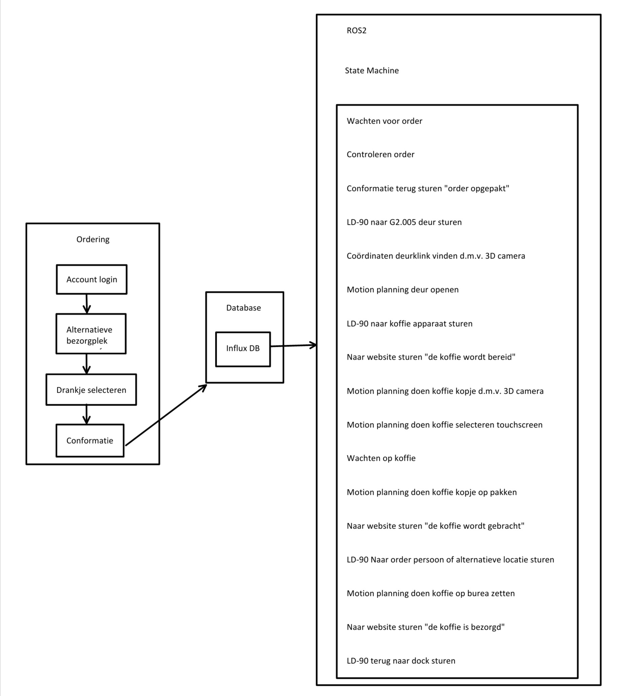

# Mobile Manipulator


Bedrijfs begeleider: Johannes Bruinsma

School begeleider: Rieno Moedt

Gemaakt door: Steven Pennock

Datum: 11 December 2023

# Samenvatting
Ik ben Steven Pennock en ik heb als stage opdracht gekregen om koffie te halen.
Nou heb ik natuurlijk helemaal geen zin om zelf iedere keer koffie te halen dus daarom ga ik een MoMa (Mobile Manupulator) maken.
Dit is een rijdende robot met daarboven op een manipulator (robot arm) geplaatst.
Op deze github pagina kan je alles vinden wat ik hiervoor heb gedaan.


Hieronder is een overzicht te zien van het programma zoals het nu de gedachte is:


# Inhoudsopgave
- 1. [Progressie](https://github.com/stebenpe/MobileManipulator#1-progressie)
- 2. [Onderdelen](https://github.com/stebenpe/MobileManipulator#2-onderdelen)
- 3. [Netwerk](https://github.com/stebenpe/MobileManipulator#3-netwerk)
- 4. [Website](https://github.com/stebenpe/MobileManipulator#4-website)
- 5. [Omron LD-90](https://github.com/stebenpe/MobileManipulator#5-omron-ld-90)
- 6. [Omron TM5M-900](https://github.com/stebenpe/MobileManipulator#6-omron-tm5m-900)
- 7. [ZED 2i](https://github.com/stebenpe/MobileManipulator#7-zed-2i)
- 8. [NVIDIA jetson AGX orin](https://github.com/stebenpe/MobileManipulator#8-nvidia-jetson-agx-orin)
- 9. [Maak onderdelen](https://github.com/stebenpe/MobileManipulator#9-maak-onderdelen)
- 10. [Ros2](https://github.com/stebenpe/MobileManipulator#10-ros2)
- 11. [Conclusie](https://github.com/stebenpe/MobileManipulator#11-conclusie)
- 12. [Bronnen](https://github.com/stebenpe/MobileManipulator#12-bronnen)

# Inleiding


# Begrippen lijst

1. ROS2: Robot Operating System 2, een veel gebruikt systeem om allerlei soorten robots aan te sturen. Er wordt geprogrammeerd met nodes in C++ en of Python, hierin kunnen python nodes met C++ nodes samenwerken zonder problemen of instellingen wat het erg vrij maakt.
2. VUE.js: Een hulpmiddel voor het maken van een website. Dit wordt gedaan met HTML, Java Script en CSS.
3. AMR: Autonomous Mobile Robot, oftewel een autonome rijden robot.

# Build
Als eerst moet er gecontroleerd worden of alle dependencies zijn geinstalleerd die ROS2 nodig heeft voor de te builden package.
Dit kan gedaan worden door de volgende command line uit te voeren in de ros2_ws directory
```
rosdep update && rosdep install --from-paths src --ignore-src -r -y
```

Gebruik het volgende in de terminal om recourses te beperken bij het build process:

```
export MAKEFLAGS="-j2 -l5"
```

Ga vervolgens naar de ros2_ws map en doe:
```
colcon build
```

Dit kan eventueel ook op de volgende manier als je wil dat je bij het aanpassen van de code hij dit ook meteen meeneemt.
Let op dat als je bestandnamen veranderd of nieuwe bestanden toevoegd dit niet werkt.
```
colcon build --symlink-install
```

## 1. Progressie
Componenten:
- [x] Uitzoeken 3D camera
- [x] Uitzoeken embedded AI computer
- [x] Uitzoeken robot arm

Netwerk:
- [x] Instellen mikrotik als bridge met school wifi en eigen subnet
- [x] Instellen mikrotik met vaste ip's
- [x] ROS2 netwerk instellingen toepassen
- [ ] VPN connectie naar router netwerk

ROS2:
- [x] ROS2 installeren op Jetson AGX orin en laptop
- [x] LD-90 aansturen met ROS2
- [X] 3D camera koppelen met ROS2
- [X] 3D map genereren met 3D camera
- [X] Ordering systeem koppelen met ROS2
- [X] MoveIt2 instellen robot arm
- [X] Maken state machine voor aansturen AMR en robot arm
- [X] ROS2 connectie maken met robot arm
- [ ] URDF samenvoegen LD-90, 3D camera, robot arm en gripper
- [ ] robot arm programma maken

Website:
- [x] Website maken
- [x] Data LD-90 visualiseren op website
- [X] Ordering systeem maken
- [ ] RVIZ2 visualiseren op website
- [ ] Camera beeld visualiseren op website

Besturingskast: 
- [X] Onderdelen uitzoeken en bestellen
- [x] 3D ontwerp besturingskast
- [x] EPLAN tekening besturingskast
- [ ] Safety PLC programma maken
- [ ] Besturingskast bedraden

Maak onderdelen:
- [X] SolidWorks designen trap sensor
- [x] SolidWorks designen alluminium behuizing
- [x] SolidWorks designen 3D prints
- [x] Totaal assembly SolidWorks maken
- [X] Onderdelen 3D printen
- [X] onderdelen watersnijden
- [X] onderdelen buigen, boren, tappen en verzinken
- [X] MoMa inelkaar zetten
- [ ] Powder coaten onderdelen
- [ ] Designen bekerhouder met magneten
- [ ] Maken bekerhouder met magneten
- [ ] Flexibele gripper designen en maken


## 2. Onderdelen
- Omron LD-90 AMR (met zei lidar)
- Omron TM5M-900 robot arm
- Robotiq 2F-85 gripper
- ZED 2i 3D camera
- NVIDIA jetson AGX orin embedded AI computer
- MikroTik RB2011UiAS-2HnD router

## 3. Netwerk
Hieronder is een overzicht te zien van hou het huidige netwerk in elkaar zit:


Dit netwerk is gerealiseerd door middel van een MikriTik RB2011UiAS-2HnD.
Deze is op de MoMa bevestigd en word gevoed door de Omron LD-90 via de 12V lijn

## 4. Website
De website is gemaakt door middel van VUE.js en werkt door middel van een websocket met de robot samen.
Voor meer uitleg over de website kan je kijken naar de [readme](https://github.com/stebenpe/MobileManipulator/tree/main/vue-webpanel#website) van de vue-webpanel.

## 5. Omron LD-90
De Omron LD-90 word gebruikt als het basisplatform van de MoMa.

Voor meer informatie over de Omron LD-90 kan je kijken naar de [readme](https://github.com/stebenpe/MobileManipulator/tree/main/omron-ld-90) van de Omron LD-90.

## 6. Omron TM5M-900
De Omron TM5M-900 is de gebruikte robot arm in dit project.
Dit omdat deze een groot bereik heeft van 900 mm en omdat dit een cobot is. cobot betekent dat er geen veiligheids scherm omheen nodig is omdat bij te veel weerstand de robot arm stopt. Dit kan bijvoorbeeld gebeuren als iemand zijn hand tussen de robot arm doet. Ook is deze robot arm bedoeld voor modile applicaties waardoor deze op een accu kan werken van tussen de 22 en 60 volt.

Voor meer informatie over de Omron TM5M-900 kan je kijken naar de [readme](https://github.com/stebenpe/MobileManipulator/tree/main/Omron%20TM5M-900) van de Omron TM5M-900.

## 7. ZED 2i


## 8. Nvidia jetson AGX orin
Voor dit project is gekozen voor een NVIDIA Jetson AGX orin 64GB developer kit. De keuze is hiervoor gemaakt omdat deze veel AI power heeft door de 2048 cuda cores en 64 tensor cores. Deze woren vooral gebruikt voor de 3D camera met het AI programma en de 3D visualisatie van de robot via RVIZ2. Ook is het modelijk om de Jetson te voeden met een accu van tussen de 9 en 20 volt. In het geval van dit project wordt de Jetson gevoed door middel van de 12 volt lijn.

## 9. Maak onderdelen
Voor het maken van de MoMa zijn verschilende onderdelen gemaakt. Van de watersnijder tot de 3D printer. In het mapje [maak onderdelen](https://github.com/stebenpe/MobileManipulator/tree/main/maak%20onderdelen) is hier meer over te vinden.

## 10. Besturingskast
Op de besturingskast zit de safety PLC, embedded AI computer en de DC-DC converters. Er is ook wat ruimte overgehouden voor toekomstige uitbreidingen. Voor meer informatie over de besturingskast kan je de [readme](https://github.com/stebenpe/MobileManipulator/tree/main/besturingskast) bekijken van de map besturingskast.


## 11. Ros2
Hier veranderd momenteel nog te veel in om documentatie over te schrijven.

## 12. Conclusie
Er is nog geen zekerheid over de ideeen en dus nog geen conclusie.

## 13. Bronnen lijst


[^1]: Gemaakt door Steven Pennock 2023.